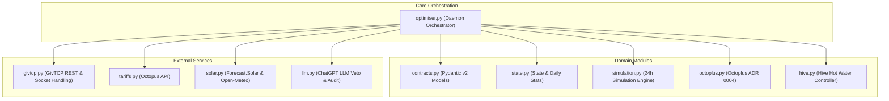

# ⚡ GivEnergy Tariff Optimiser

A Home Assistant add-on that automatically schedules your GivEnergy battery to charge during the cheapest Octopus Agile half-hour slots, taking into account your solar forecast and current battery state of charge.

> **Designed for:** Octopus Agile tariff customers with GivEnergy inverters and solar panels running Home Assistant.

---

## ✨ Features

- 🔋 **Reads live battery SoC** via GivTCP REST API v2/v3 (falls back to direct Modbus TCP)
- ☀️ **Dual parallel solar forecasting** — Forecast.Solar API primary + [Open-Meteo Solar API](https://open-meteo.com) shadow provider with real-time accuracy logging
- ⚡ **Octopus Agile rate fetching** — pulls all upcoming 30-minute pricing slots
- 💱 **Live Octopus export rate** — fetches Outgoing Variable rate so arbitrage self-adjusts
- 📊 **24-hour simulation & dynamic load profiling** — models battery/solar/load with half-hour telemetry history & hourly baseline profiles
- 🛡️ **Octopus Octoplus Power Down protection** — enforces 0.0 kWh grid import during Power Down sessions and pre-charges battery at cheaper earlier rates
- 🎯 **Arbitrage-aware & Octoplus optimiser** — charges from grid whenever import < export rate (after ~90% round-trip efficiency), or during free Octoplus sessions
- 🧠 **Smart cheapest slot search** — evaluates both contiguous and non-contiguous cheapest slot combinations across the day
- 🤖 **Smart ChatGPT plan validator** — evaluates pre-charge economics vs peak import rates avoided; produces plain-English daily audit reports
- 🔄 **Dynamic SoC Drift Re-Planning** — periodic 30-minute light monitor tick checks live SoC against planned schedule, triggering immediate re-planning if drift > `15.0%`
- 🧩 **Flattened Modular Architecture** — clean separation into `givtcp.py`, `tariffs.py`, `solar.py`, `solar_openmeteo.py`, `profiler.py`, and `llm.py`
- 📋 **Technical Specification & Contract Testing** — formal [`SPECIFICATION.md`](file:///home/reg/Coding/GivEnergy_Tracker/ha-addon/SPECIFICATION.md) and API contract test suite (`tests/test_contracts.py`)
- 🏷️ **Single-Source Versioning** — `version.py` (`1.0.22.4`) synced with `config.yaml` to ensure zero version drift
- 🏠 **Native Home Assistant add-on** — installs directly from a local repository

---

## 🏗️ Architecture

For complete API contracts, component specifications, and Mermaid sequence diagrams, see [`ha-addon/SPECIFICATION.md`](file:///home/reg/Coding/GivEnergy_Tracker/ha-addon/SPECIFICATION.md).

```
GivEnergy_Tracker/
├── ha-addon/                      ← The Home Assistant add-on package
│   ├── version.py                 ← Single source of truth for version (__version__ = "1.0.20")
│   ├── config.yaml                ← Add-on manifest (name, version, options)
│   ├── Dockerfile                 ← Builds the add-on container (python:3.11-slim)
│   ├── run.sh                     ← Entrypoint: reads HA options, launches optimiser
│   ├── config.py                  ← Real credentials & settings
│   ├── optimiser.py               ← Main optimization orchestrator & simulation loop
│   ├── givtcp.py                  ← GivTCP REST API v2/v3 & Modbus TCP integration
│   ├── tariffs.py                 ← Octopus Agile & Outgoing export rates
│   ├── solar.py                   ← Forecast.Solar API client & parallel comparison manager
│   ├── solar_openmeteo.py         ← Open-Meteo Solar API client (shadow provider)
│   ├── profiler.py                ← Dynamic load profiling & Power Down detection
│   ├── llm.py                     ← Smart ChatGPT veto validator & daily summary report
│   ├── tracker.py                 ← Lightweight Octopus API connection test
│   ├── requirements.txt           ← Python dependencies
│   ├── SPECIFICATION.md           ← Complete technical specification & architecture
│   └── DOCS.md                    ← Add-on user documentation
├── tests/                         ← Pytest test suite (includes contract tests)
├── README.md
├── CHANGELOG.md
├── LICENSE
└── .gitignore
```

### Data Flow

```
                            Once per day (daily planner @ 17:00)
Octopus Agile rates   ──┐
Octopus Export rate   ──┤
Forecast.Solar        ──┼──► optimiser.py ─┬─► Deterministic Plan  ─┐
GivTCP (SoC)          ──┤     Simulation   │   (arbitrage + deficit)│
Persisted state       ──┘                  └─► ChatGPT Veto (score) ┘
                                                    │
                                            ┌───────┴─────────┐
                                     approve│                 │veto
                                            ▼                 ▼
                                     GivTCP REST         Clear slots
                                     (write plan)             │
                                            │                 │
                                            └────────┬────────┘
                                                     ▼
### 🏛️ Modular Domain Architecture



---

### ⏰ Daily Execution Timeline

```mermaid
gantt
    title Daily Optimiser Execution Timeline
    dateFormat  HH:mm
    axisFormat %H:%M

    section Octopus Tariff
    Tomorrow's Rates Published (16:00-16:30) :milestone, m1, 16:30, 0min

    section Daemon Tasks
    Daily Planning Run (Fetch rates, solar & program inverter) :active, p1, 17:00, 30min
    Light Monitor Checks (Periodically verify battery SoC) :m2, 17:30, 5h
    End-of-Day Audit (ChatGPT Financial Savings Report) :crit, a1, 23:00, 30min
    Inverter Executes Scheduled Overnight Charging :done, c1, 02:00, 3h
```

---

### 🌤️ Weather-Adaptive Solar Strategy & Export Arbitrage

For full technical details, see the dedicated [Weather-Adaptive Solar Strategy & Arbitrage Guide](file:///home/reg/Coding/GivEnergy_Tracker/ha-addon/ARBITRAGE_AND_WEATHER.md) subpage.

```mermaid
flowchart TD
    A[Daily Planning Run at 17:00] --> B[Calculate Net Solar Surplus\nForecast Solar − House Load]
    
    B --> C{Agile Rates Negative < 0p?}
    C -->|YES| D[⚡ NEGATIVE_RATE_OPPORTUNITY\nImport Grid Power (Grid pays you!)]
    
    C -->|NO| E{Net Solar Surplus vs Battery Space?}
    
    E -->|Surplus ≥ Battery Deficit| F[☀️ HIGH_SOLAR_SELF_CONSUMPTION\n0 W Grid Draw\nFree solar PV fills battery]
    
    E -->|Surplus 40% to 99% of Deficit| G[⛅ MEDIUM_SOLAR_PARTIAL_PRECHARGE\nPartial Pre-Charge for Peak Hours\nLeaves 30%-50% headroom for solar surges]
    
    E -->|Surplus < 40% of Deficit| H[🌧️ LOW_SOLAR_GRID_PRECHARGE\nFull Grid Pre-Charge\nGuarantees 100% SoC before 16:00 peak]
```

---

### 🚀 Future Hardware Roadmap & Planned Enhancements

The add-on currently features software simulation and fail-safe logic for heating and hot water. Physical hardware controls will be enabled once hardware installation is finalized:

- **⚡ Direct iBoost Hardware Relay Override (Planned)**: Physical smart relay integration (e.g. Shelly / ESPHome relay contact) to programmatically override the iBoost controller during negative/plunge electricity rate slots ($< 0.0\text{p/kWh}$), forcing 3 kW immersion heating from cheap/negative grid power even when solar PV generation is 0 W.
- **🌡️ Hot Water Cylinder Temperature Sensors (Planned)**: Installation of multi-point 1-Wire DS18B20 or Zigbee cylinder probes (top/middle/bottom) to measure exact thermal stratification ($^\circ\text{C}$) and stored thermal energy ($\text{kWh}$). When missing, `evaluate_morning_shower_safety(tank_temp_c)` defaults to `SAFE` mode (keeping Hive gas boiler on `"schedule"`) to guarantee a 6:00 AM warm shower.

---

## ⚙️ Configuration Options Quick Reference

| Option | Default | Required? | First-Time User Guidance |
| :--- | :---: | :---: | :--- |
| **`interval_minutes`** | `30` | Yes | **Leave as `30`**. Wakeup check interval matching Octopus 30-minute tariff slots. |
| **`run_once`** | `false` | No | **Leave as `false`**. When `true`, runs 1 test pass then stops. Keep `false` for 24/7 background mode. |
| **`debug_logging`** | `false` | No | **Leave as `false`**. Keeps logs clean and concise. Set to `true` for verbose HTTP troubleshooting. |
| **`openai_api_key`** | `""` | Optional | **OpenAI API Key** (`sk-...`). Enables ChatGPT plan scoring & daily audit report. Optional. |
| **`openai_model`** | `gpt-4o-mini` | Optional | **AI Model Selection**. Default (`gpt-4o-mini`) is cheap (< 1p/month), fast, and accurate. |
| **`daily_plan_hour`** | `17` | Yes | **Daily Planning Hour (5:00 PM)**. Octopus publishes rates at 16:30, programming inverter 7h early. |
| **`daily_audit_hour`** | `23` | Yes | **Daily Audit Hour (11:00 PM)**. Summarizes today's financial performance right before midnight. |
| **`hive_water_heater_entity`** | `water_heater.hive_hot_water` | Optional | **Hive Hot Water Entity**. Pauses gas hot water during electric pre-charge/solar immersion. |

---

## 📋 Prerequisites

| Component | Requirement |
|-----------|------------|
| Home Assistant | 2024.1+ with Supervisor |
| GivEnergy Inverter | Any model supported by GivTCP |
| GivTCP Add-on | Installed & running in Home Assistant |
| Octopus Energy | Agile tariff (import) with API key + Outgoing Variable (export) |
| Solar Panels | With known kWp, tilt (declination), and azimuth |
| Network Share (Optional) | For persistent log files (NAS, Samba, etc.) |

### Home Assistant resources

If you're new to Home Assistant or the add-on system:

- 🏠 [Home Assistant website](https://www.home-assistant.io/) — official project home
- 🚀 [Getting started guide](https://www.home-assistant.io/getting-started/) — installation, first-boot onboarding, device integration
- 📦 [Add-ons overview](https://www.home-assistant.io/addons/) — how HA's add-on system works
- 🛠️ [Local add-on tutorial (developer docs)](https://developers.home-assistant.io/docs/add-ons/tutorial/) — the mechanics of installing a local repository
- 🔌 [GivTCP](https://github.com/britkat1980/giv_tcp) — the community add-on that talks to GivEnergy inverters (prerequisite for this tracker)
- ⚡ [Octopus Energy Developer API](https://developer.octopus.energy/) — where your API key lives

---

## 🚀 Installation & Sharing

### Adding to Home Assistant (1-Click Badge)

Click the button below to add this repository directly to your Home Assistant Add-on Store:

[](https://my.home-assistant.io/redirect/supervisor_add_addon_repository/?repository_url=https%3A%2F%2Fgithub.com%2Frevhawk%2FGivEnergy_Tracker)

### Manual Repository Installation

Any Home Assistant user can add your add-on store repository by following these steps:

1. In Home Assistant, go to **Settings → Add-ons → Add-on Store**.
2. In the top-right corner, click **⋮ (three dots) → Repositories**.
3. Add the GitHub repository URL:
   ```text
   https://github.com/revhawk/GivEnergy_Tracker
   ```
4. Click **Add**. The **GivEnergy Tariff Optimiser** card will appear in the Add-on Store!
5. Click **Install**, configure options under the **Configuration** tab, and click **Start**.

---

### Local Development Installation (Alternative)
   - **Samba share** — mount `\\homeassistant\addons\` from your desktop and copy the folder in.
   - **Terminal / SSH add-on** — `scp` or `git clone` directly onto the Pi.
2. In Home Assistant: **Settings → Add-ons → Add-on Store**. The **GivEnergy Tariff Optimiser** card will appear under **Local add-ons**.
3. If you don't see it, click **⋮ (top right) → "Check for updates"** — that forces HA to re-scan the local add-on folder.

### 2. Configure `config.py`

Before installing, populate `ha-addon/config.py` on the HA host with your credentials.
Copy from the template:

```bash
cp config.py.example config.py
```

Then edit `config.py` with your Octopus API key, MPANs, meter serial, geographic coordinates, and battery/solar hardware settings (see [Configuration Reference](#-configuration-reference) below).

> ⚠️ **`config.py` is listed in `.gitignore`** and will never be committed to Git. It contains your API keys and passwords. Treat it as a secret file — do not paste its contents into chat logs, forums, or LLM sessions.

### 3. Install & Start

1. Click **Install** on the add-on card
2. Go to the **Configuration** tab and set your options (`interval_minutes`, `openai_api_key`, `daily_plan_hour`, `daily_audit_hour`, `startup_write_test`)
3. Click **Start**
4. Watch the **Log** tab. On first startup you should see:
   - Version banner: `GivEnergy Tariff Optimiser v1.0.22.3`
   - Effective config dump (verifies your `config.py` values)
   - First planning run (`===== DAILY PLANNING RUN (first plan since startup) =====`)

### 4. Updating to a newer version

After you edit any file on the HA host (either by editing directly or SMB-copying new versions):

1. Bump `version:` in `ha-addon/config.yaml` AND `__version__` in `ha-addon/version.py` (they must match)
2. **Reload the add-on store** — Settings → Add-ons → Add-on Store → ⋮ → **Check for updates**. This is the step most easily forgotten — HA caches version metadata and won't detect the change without this refresh.
3. Click **Update** on the add-on card (or ⋮ → **Rebuild** if you want to force a fresh image build)
4. Confirm the log banner shows the new version `v1.0.22.3`

---

## ⚙️ Configuration Reference

### Home Assistant Options (via UI)

| Option | Type | Default | Description |
|--------|------|---------|-------------|
| `interval_minutes` | int | `30` | Daemon wake-up cadence. Full re-plan fires once per day; other ticks are cheap SoC-only reads. |
| `run_once` | bool | `false` | Exit after one planning pass (useful for testing) |
| `openai_api_key` | str | `""` | OpenAI API key. Enables plan scoring/veto and end-of-day audit. |
| `openai_model` | dropdown | `"gpt-4o-mini"` | OpenAI model selector (`gpt-4o-mini`, `gpt-4o`, `gpt-3.5-turbo`) |
| `daily_plan_hour` | int | `17` | Local hour to fire the daily planner (typically after Octopus publishes tomorrow's rates) |
| `daily_audit_hour` | int | `23` | Local hour to fire the end-of-day audit |
| `log_file_path` | str | `"/share/nas_logs/givenergy_tracker.log"` | Network / SMB path for timestamped logs and daily performance history (`/share/nas_logs/history/`) |

### `config.py` Settings

```python
# ─── Inverter ───────────────────────────────────────────────────────────────
INVERTER_IP    = "192.168.1.xx"   # Static IP of your GivEnergy inverter
INVERTER_PORT  = 8899             # Modbus TCP port (usually 8899 or 502)

# ─── GivTCP ─────────────────────────────────────────────────────────────────
GIVTCP_URL     = "http://192.168.1.xx:6345"   # GivTCP REST API URL
                                               # Set to None to force Modbus only

# ─── Octopus — Import (Agile) ───────────────────────────────────────────────
OCTOPUS_API_KEY    = "sk_live_xxxxxxxxxxxx"
OCTOPUS_ACCOUNT_ID = "A-XXXXXXXX"
ELEC_IMPORT_MPAN   = "1419xxxxxxxxx"          # Import meter point (Agile)
ELEC_SERIAL        = "19Kxxxxxxxx"            # Shared serial for both directions
AGILE_PRODUCT_CODE = "AGILE-24-10-01"
AGILE_TARIFF_CODE  = "E-1R-AGILE-24-10-01-E"  # Change final letter for your region

# ─── Octopus — Export (Outgoing Variable) ───────────────────────────────────
ELEC_EXPORT_MPAN       = "1470xxxxxxxxx"      # Export meter point
EXPORT_PRODUCT_CODE    = "OUTGOING-VAR-24-10-26"
EXPORT_TARIFF_CODE     = "E-1R-OUTGOING-VAR-24-10-26-E"
EXPORT_RATE_P_FALLBACK = 12.0                 # Used only if live fetch fails
ARBITRAGE_MARGIN_P     = 0.5                  # Import must be below (export − margin)
                                              # for arbitrage to fire

# ─── Solar Array ─────────────────────────────────────────────────────────────
LATITUDE          = 52.7073   # Your home latitude
LONGITUDE         = -2.7553   # Your home longitude
SOLAR_DECLINATION = 35        # Panel tilt in degrees (0 = flat, 90 = vertical)
SOLAR_AZIMUTH     = 0         # 0 = South, -90 = East, +90 = West
SOLAR_KWP         = 10.0      # Total array capacity in kWp

# ─── Battery ─────────────────────────────────────────────────────────────────
BATTERY_CAPACITY_KWH     = 9.5    # Usable battery capacity in kWh
MAX_BATTERY_CHARGE_RATE  = 3000   # Max charge rate in Watts

# ─── Home Load ───────────────────────────────────────────────────────────────
BASE_LOAD_W             = 1000   # Baseline home consumption in Watts. Set from
                                 # your true overnight draw — under-estimating
                                 # causes the tracker to skip needed charges.
IBOOST_MAX_DIVERT_RATE  = 3000   # Solar iBoost immersion heater diversion cap (W)

# ─── Logging ─────────────────────────────────────────────────────────────────
LOG_FILE_PATH = "/share/nas_logs/givenergy_tracker.log"   # NAS mount path
LOG_LEVEL     = "INFO"   # DEBUG | INFO | WARNING | ERROR

# ─── Optional: OpenAI ────────────────────────────────────────────────────────
OPENAI_API_KEY = ""   # Leave blank to disable ChatGPT scoring/veto/audit
```

---

## 🧠 How the Optimiser Works

The daemon runs on a `interval_minutes` cycle (default 30 min) but does full planning **only once per day**. Each tick picks one of three modes:

### Daily planner (once/day at `daily_plan_hour`, default 17:00)

1. **Fetch Agile import rates** — public Octopus product endpoint, all upcoming half-hour slots
2. **Fetch Outgoing Variable export rate** — cached 6h; used for arbitrage decisions
3. **Fetch solar forecast** — Forecast.Solar hourly kWh estimate
4. **Read battery SoC** — GivTCP REST (Modbus fallback)
5. **Simulate 24h** without any grid charge, using `BASE_LOAD_W` as continuous load
6. **Decide action:**
   - **Deficit charge** if predicted import > 0.2 kWh — cheapest contiguous window
   - **Arbitrage charge** if any slot is below `(export_rate − ARBITRAGE_MARGIN_P)` — profitable even when solar could cover, because imported cheap energy displaces solar that then exports at 12p
   - **Negative-rate override** — always fill battery when grid pays you
   - **No charge** otherwise, clear slots
7. **LLM veto** (if OpenAI configured) — ChatGPT reviews the plan and returns `{approve, score 1-10, reason}` in JSON. Vetoes clear the slots as a fallback. Fails-open on error/timeout.
8. **Write to inverter** — via GivTCP `setChargeEnable` / `setChargeTarget` / `setChargeSlot1` / `setChargeSlot2` (window splits across midnight if needed)
9. **Persist snapshot** — writes the day's plan to `/share/nas_logs/givenergy_state.json` for the audit

### Light monitor (every other tick, ~46×/day)

Just reads SoC from GivTCP and logs it. No LLM, no re-planning, no inverter writes.

### End-of-day audit (once/day at `daily_audit_hour`, default 23:00)

Loads the plan snapshot + daily stats, then sends the day's context to ChatGPT for an English-language verdict and algorithm-tuning suggestions. Logged to file.

### Cost / arbitrage model

- **Import cost** = `charge_kwh × avg_slot_price`
- **Export income** = live-fetched Outgoing Variable rate (currently 12p flat)
- **Round-trip battery efficiency** ≈ 90%, giving a break-even at `~10.8p`
- **Arbitrage margin** (`ARBITRAGE_MARGIN_P`, default 0.5p) keeps the tracker from chasing marginal opportunities

---

## 🔌 GivTCP Connectivity

The optimizer supports two methods to communicate with the inverter:

| Method | How | When Used |
|--------|-----|-----------|
| **GivTCP REST API** | HTTP to `GIVTCP_URL` | Preferred (when GivTCP add-on is running) |
| **Direct Modbus TCP** | TCP to `INVERTER_IP:INVERTER_PORT` | Fallback (requires `givenergy-modbus` package) |

If `GIVTCP_URL` is set and reachable, REST is always tried first. Direct Modbus is only used as a fallback.

---

## 📦 Versioning

This project follows [Semantic Versioning](https://semver.org/):

| Version Range | Meaning |
|--------------|---------|
| `0.0.x` | Test builds — bug fixes and config tweaks |
| `0.x.0` | Beta builds — new features |
| `1.0.0+` | Stable production releases |

When releasing a new version, increment the version string in the following files:
- **`ha-addon/config.yaml`**: `version: "x.y.z"` (read by Home Assistant store to prompt updates)
- **`ha-addon/optimiser.py`**: `__version__ = "x.y.z"` (checked at runtime on startup)
- **`ha-addon/CHANGELOG.md`**: `## [x.y.z] - YYYY-MM-DD` and updated link definitions at bottom

When the version number in `ha-addon/config.yaml` is bumped, Home Assistant will show an **Update** badge on the add-on card — no reinstall required.

---

## 🔐 Security Notes

**`config.py` contains live credentials.** Handle it accordingly:

- It is listed in `.gitignore` and should never be committed. Rely on this only as a first line of defence — a `git add -f` still bypasses it.
- Its contents are stored **in plaintext** on the Home Assistant host and inside the running container. Anyone with SSH/terminal access to the host can read it.
- HA add-on options set via the UI (like `openai_api_key`) live in `/data/options.json` on the host — also plaintext, contrary to what earlier docs implied.
- **Never paste `config.py` contents into a chat log, forum post, screenshot, or LLM conversation.** Once transmitted, treat the secrets as compromised and rotate them (Octopus dashboard, OpenAI dashboard, NAS admin).
- **Rotation is cheaper than an audit.** If in doubt, rotate.

### What's in it that matters

| Secret | Blast radius if leaked |
|---|---|
| `OCTOPUS_API_KEY` | Full account access — bills, tariffs, PII |
| `OPENAI_API_KEY` | Billable API access at your expense |
| `NAS_USER` / `NAS_PASSWORD` | SMB read/write on your NAS |
| `ELEC_MPAN` / `ELEC_SERIAL` / `GAS_MPRN` | UK utility identifiers — usable for change-of-supplier fraud |
| `LATITUDE` / `LONGITUDE` | Precise home coordinates |

---

## 🛠️ Development

### First-time setup

```bash
git clone https://github.com/revhawk/GivEnergy_Tracker.git
cd GivEnergy_Tracker/ha-addon
cp config.py.example config.py
# Edit config.py with your credentials, MPANs, and site geometry
```

### Editing the add-on

1. Edit files under `ha-addon/`.
2. **Rebuild** the add-on in Home Assistant (Settings → Add-ons → GivEnergy Tariff Optimiser → ⋮ → **Rebuild**). Restart alone won't pick up changes because `config.py` and `optimiser.py` are baked into the container image at build time.
3. Watch the **Log** tab. The startup banner shows the effective config values so you can verify your edits took.

### Running one planning pass on demand

Set `run_once: true` in the add-on's Configuration tab, then Start it. It'll do a full plan, write to the inverter, and exit.

### Testing in Local Environment

To set up your local development environment and run unit tests inside a virtual environment (`.venv`):

```bash
# 1. Create virtual environment from project root
python3 -m venv .venv

# 2. Activate the virtual environment
source .venv/bin/activate

# 3. Install add-on & test suite dependencies
pip install -r ha-addon/requirements.txt -r tests/requirements.txt

# 4. Run the full unit test suite
pytest

# 5. Run pytest in verbose mode or run specific tests
pytest -v
pytest tests/test_optimization.py

# 6. (Optional) Run local optimizer dry-run inside .venv
python ha-addon/optimiser.py
```

Test targets and coverage are documented in [`tests/README.md`](tests/README.md).

---

## 💬 Community & Support

- 🐛 **Report a Bug / Request a Feature**: Open an issue on [GitHub Issues](https://github.com/revhawk/GivEnergy_Tracker/issues)
- 📋 **View Release Notes**: Check out the [Changelog](https://github.com/revhawk/GivEnergy_Tracker/blob/main/ha-addon/CHANGELOG.md)
- 📖 **Add-on Documentation**: Read the full [DOCS.md](https://github.com/revhawk/GivEnergy_Tracker/blob/main/ha-addon/DOCS.md)
- 🐙 **GitHub Repository**: [revhawk/GivEnergy_Tracker](https://github.com/revhawk/GivEnergy_Tracker)

---

## 📜 Licence

This project is licensed under the Apache 2.0 License — see [LICENSE](LICENSE) for details.

---

## 🙏 Acknowledgements

- [GivTCP](https://github.com/britkat1980/giv_tcp) — excellent GivEnergy integration for Home Assistant
- [Octopus Energy Developer API](https://developer.octopus.energy/docs/api/) — free, open tariff data
- [Forecast.Solar](https://forecast.solar) — free solar generation forecasts
- [givenergy-modbus](https://github.com/dewet22/givenergy-modbus) — Python Modbus library for GivEnergy inverters
