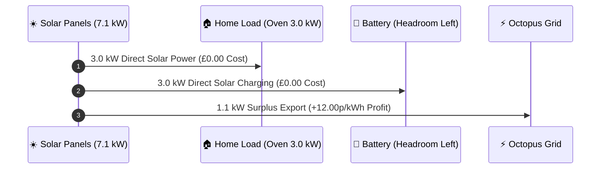

# Weather-Adaptive Solar Strategy & Export Arbitrage Guide

This guide explains how the **GivEnergy Tariff Optimiser** dynamically manages battery pre-charging, solar self-consumption, and grid export arbitrage without hardcoded summer/winter calendar rules.

---

## 🌤️ The Weather-Adaptive Architecture

UK weather changes day-by-day. Instead of relying on static calendar months (which fail on rainy summer weekends or sunny autumn days), the optimiser evaluates **tomorrow's live solar forecast (`forecast_solar_kwh`) vs. expected house load (`forecast_load_kwh`)** during the 17:00 daily planning run.

```mermaid
flowchart TD
    A[Daily Planning Run at 17:00] --> B[Calculate Tomorrow's Net Solar Surplus\nForecast Solar − House Load]
    
    B --> C{Agile Rates Negative < 0p?}
    C -->|YES| D[⚡ NEGATIVE_RATE_OPPORTUNITY\nImport Grid Power (Grid pays you!)]
    
    C -->|NO| E{Net Solar Surplus vs Battery Space?}
    
    E -->|Surplus ≥ Battery Deficit| F[☀️ HIGH_SOLAR_SELF_CONSUMPTION\n0 W Grid Draw\nLet free solar PV fill battery to 100%]
    
    E -->|Surplus 40% to 99% of Deficit| G[⛅ MEDIUM_SOLAR_PARTIAL_PRECHARGE\nPartial Pre-Charge for Peak Hours\nLeaves 30%-50% headroom for solar surges]
    
    E -->|Surplus < 40% of Deficit| H[🌧️ LOW_SOLAR_GRID_PRECHARGE\nFull Grid Pre-Charge\nGuarantees 100% SoC before 16:00 peak]
    
    F --> I[Send Plan & Day Classification to ChatGPT AI]
    G --> I
    H --> I
    D --> I
    
    I --> J[ChatGPT Scores 1-10 & Evaluates Weather Risk]
    J --> K[Program Inverter Slots & Archive History to NAS]
```

---

## 📊 The 4-Tier Day Classifier Matrix

| Day Classification | Solar Forecast vs. Battery Deficit | Grid Pre-Charge Action | Battery Headroom Benefit |
| :--- | :--- | :--- | :--- |
| ☀️ **`HIGH_SOLAR_SELF_CONSUMPTION`** | Solar Surplus $\ge$ Battery Deficit | **0 W Grid Draw** (Grid Charge OFF) | Battery fills 100% from FREE solar power. |
| ⛅ **`MEDIUM_SOLAR_PARTIAL_PRECHARGE`** | Solar Surplus 40%–99% of Deficit | **Partial Pre-Charge** (e.g. 50%–70% Target SoC) | Pre-charges cheap grid power to cover peak load while **leaving 30%–50% top headroom** to catch live solar surges. |
| 🌧️ **`LOW_SOLAR_GRID_PRECHARGE`** | Solar Surplus < 40% of Deficit | **Full Grid Pre-Charge** (100% Target SoC) | Locks in cheap Agile rates to protect home from 45p–50p peak evening rates. |
| ⚡ **`NEGATIVE_RATE_OPPORTUNITY`** | Import Rates < 0.00p | **Full Grid Import** | Grid pays you to take electricity. |

---

## 🍳 Real-World Case Study: 7.1 kW Solar Surge + 3 kW Oven Demand

Imagine a bright afternoon where solar generation surges to **7.1 kW** while someone turns the kitchen oven on (**3.0 kW**):



### Financial Result:
- **Oven Power**: Powered 100% by solar ($\text{Cost} = £0.00$).
- **Battery Charging**: Charged 3.0 kW from solar ($\text{Cost} = £0.00$).
- **Surplus Solar**: 1.1 kW exported to Octopus Outgoing ($\text{Profit} = +12.00\text{p/kWh}$).
- **Grid Import**: **0 Watts**.

---

## 🤖 ChatGPT AI Co-Pilot & Historical Archive

Every day after classification, scenario details are sent to OpenAI ChatGPT:
1. **AI Score (1–10)**: Evaluates economic efficiency.
2. **`weather_risk_commentary`**: Evaluates potential cloud cover shifts and recommends safety buffers.
3. **NAS History Archiving**: All data is saved into `/share/nas_logs/history/daily_stats_YYYY-MM-DD.json`, allowing you to review historical AI decisions and solar accuracy over time.
