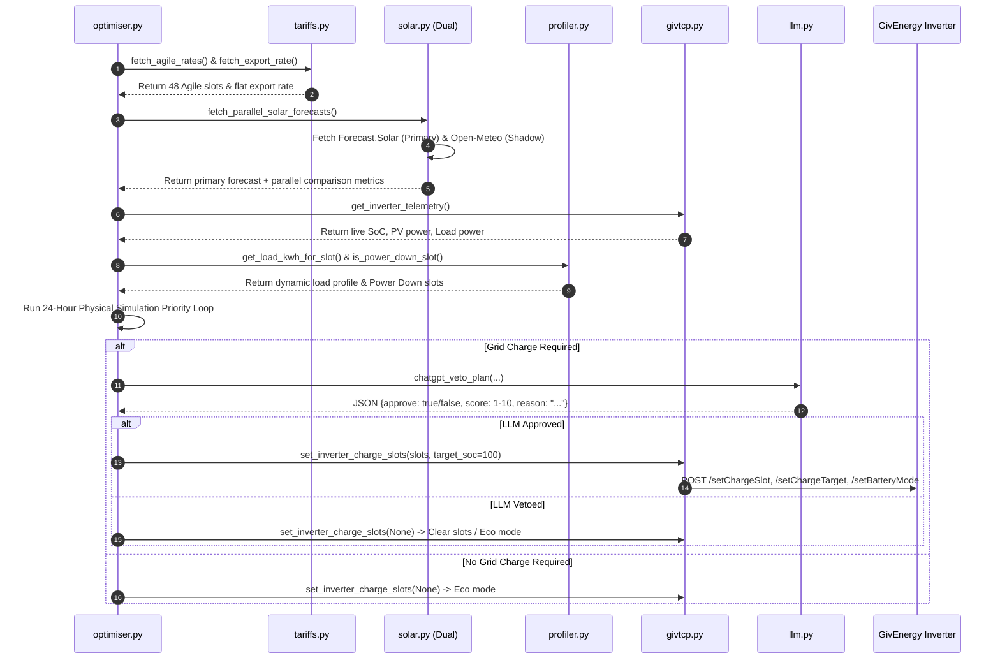
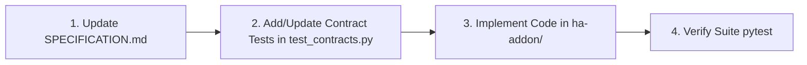

# Technical Specification & Architecture — GivEnergy Tariff Optimiser

**Version:** 1.0.21.2  
**Target Hardware:** GivEnergy Inverters (Gen 1, Gen 2, Gen 3, All-in-One)  
**Target Platform:** Home Assistant Add-on Container (Linux ARM64 / AMD64)  

---

## 1. Executive Summary & Overview

The **GivEnergy Tariff Optimiser** is an autonomous energy cost optimization engine designed for UK homes with GivEnergy battery storage, solar PV arrays, and dynamic time-of-use tariffs (e.g. Octopus Agile & Octopus Outgoing).

The system models a 24-hour forward physical simulation of home energy balance (Solar $\rightarrow$ Home Demand $\rightarrow$ Battery State of Charge $\rightarrow$ Hot Water iBoost Diversion $\rightarrow$ Grid Export/Import). It evaluates both contiguous and non-contiguous low-cost import windows, calculates optimal pre-charging for peak deficit hours and Octoplus Power Down sessions, validates plan economics via a structured LLM Veto framework (OpenAI GPT), and programs the GivEnergy inverter via GivTCP REST API v2/v3.

---

## 2. System Architecture

```mermaid
graph TD
    subgraph External Services
        Agile[Octopus Agile API]
        Outgoing[Octopus Outgoing Export API]
        FSolar[Forecast.Solar API]
        OMeteo[Open-Meteo Solar API]
        OpenAI[OpenAI ChatGPT API]
    end

    subgraph GivEnergy Tariff Optimiser Add-on
        Version[version.py - v1.0.20]
        Config[config.py - Settings]
        Optimiser[optimiser.py - Main Loop & Engine]
        GivTCP_Mod[givtcp.py - GivTCP REST v2/v3]
        Tariff_Mod[tariffs.py - Tariff Fetcher]
        Solar_Mod[solar.py - Dual Solar Fetcher]
        Meteo_Mod[solar_openmeteo.py - Shadow Solar]
        Profiler_Mod[profiler.py - Load & Power Down]
        LLM_Mod[llm.py - ChatGPT Veto & Audit]
        Hive_Mod[hive.py - Decoupled Hive Controller v1.0.21 Spec]
    end

    subgraph Local Network
        GivTCP[GivTCP Service :6345]
        Inverter[GivEnergy Inverter]
        HA_API[Home Assistant Core REST API]
        Hive[Hive Hot Water Controller]
    end

    Agile --> Tariff_Mod
    Outgoing --> Tariff_Mod
    FSolar --> Solar_Mod
    OMeteo --> Meteo_Mod
    Meteo_Mod --> Solar_Mod

    Tariff_Mod --> Optimiser
    Solar_Mod --> Optimiser
    Profiler_Mod --> Optimiser
    GivTCP_Mod <--> GivTCP
    GivTCP <--> Inverter

    Optimiser --> LLM_Mod
    LLM_Mod <--> OpenAI
    Optimiser --> GivTCP_Mod
    Optimiser -. v1.0.21 .-> Hive_Mod
    Hive_Mod <--> HA_API
    HA_API <--> Hive
```

---

## 3. Data Flow & Optimization Sequence



---

## 4. Component Contracts & Interface Specifications

### 4.1 Single-Source Versioning Contract (`version.py`)
- **Module:** `version.py`
- **Variable:** `__version__ = "1.0.20"`
- **Contract:** MUST match `version:` field in `ha-addon/config.yaml`. Validated during daemon initialization.

### 4.2 GivTCP REST v2/v3 Contract (`givtcp.py`)
- **Base Endpoint:** `http://<GIVTCP_IP>:6345`
- **Endpoints Used:**
  - `GET /getCache`: Returns inverter telemetry dict containing nested keys `SOC`, `PV_Power`, `Load_Power`, `charge_slot_1`, `charge_slot_2`.
  - `POST /setChargeSlot`: Payload `{"start": "HH:MM", "finish": "HH:MM", "slot": "1".."10", "chargeToPercent": int}`.
  - `POST /setChargeTarget`: Payload `{"chargeToPercent": int}`.
  - `POST /setBatteryMode`: Payload `{"mode": "Timed Demand"}` (when charging) or `{"mode": "Eco"}` (when clearing).
  - `POST /enableChargeSchedule`: Payload `{"state": "enable"}` or `{"state": "disable"}`.

### 4.3 Octopus Energy Tariff Contract (`tariffs.py`)
- **Agile Import API:** `https://api.octopus.energy/v1/products/AGILE-24-10-01/electricity-tariffs/E-1R-AGILE-24-10-01-E/standard-unit-rates/`
- **Outgoing Export API:** `https://api.octopus.energy/v1/products/OUTGOING-VAR-24-10-26/electricity-tariffs/E-1R-OUTGOING-VAR-24-10-26-E/standard-unit-rates/`
- **Payload Contract:** JSON containing `results: [{ valid_from, valid_to, value_inc_vat }]`.

### 4.4 Dual Solar Provider Contract (`solar.py` & `solar_openmeteo.py`)
- **Primary Provider (Forecast.Solar):** `https://api.forecast.solar/estimate/{lat}/{lon}/{decl}/{azim}/{kwp}`
  - Applies `MORNING_SOLAR_DAMPING` (`0.65x`) for slots starting before 09:00 local time.
- **Secondary Provider (Open-Meteo):** `https://api.open-meteo.com/v1/forecast?latitude={lat}&longitude={lon}&hourly=global_tilted_irradiance&tilt={tilt}&azimuth={azm}&forecast_days=2`
  - Computes hourly kWh from global tilted irradiance (GTI in W/m²).
- **Comparison Logging Contract:**
  Log format: `☀️ [PARALLEL SOLAR COMPARISON] Primary (Forecast.Solar): X.XX kWh | Secondary (Open-Meteo): Y.YY kWh | Diff: Z.ZZ kWh`.

### 4.5 Dynamic Load & Power Down Profiler (`profiler.py`)
- **Load Profiler:** Evaluates half-hour rolling historical averages (`load_profile_history["HH:MM"]`). Falls back to hourly baselines:
  - Overnight (23:00 - 06:00): 400 W (`0.20 kWh`)
  - Daytime (06:00 - 17:00 & 20:00 - 23:00): 700 W (`0.35 kWh`)
  - Evening Peak (17:00 - 20:00): 1200 W (`0.60 kWh`)
- **Power Down Detector:** Evaluates `POWER_DOWN_WINDOWS` (e.g. `[("18:00", "19:00")]`). Enforces `0.0 kWh` grid import during window.

### 4.6 Smart ChatGPT LLM Veto Contract (`llm.py`)
- **Model:** `gpt-4o-mini` (configurable)
- **JSON Response Format:**
  ```json
  {
    "approve": true,
    "score": 9,
    "reason": "Charging at 25.72p/kWh (28.58p effective) avoids 50.88p peak rate, saving money."
  }
  ```

### 4.7 Decoupled Hive Hot Water Module Contract (`hive.py` — v1.0.21 Spec)
- **Module:** `hive.py` (decoupled, standalone module)
- **Home Assistant Service Endpoint:** `POST /api/services/water_heater/set_operation_mode`
- **Target Entity:** `water_heater.hive_hot_water` (configurable in `config.py` via `HIVE_WATER_HEATER_ENTITY`)
- **Supported Modes:**
  - `"off"`: Cancels Hive gas boiler schedule (used during plunge rates, electric pre-charge, or satisfied tank).
  - `"schedule"`: Restores default Hive gas boiler schedule (used when tank temperature is low or no electric pre-charge occurred).

### 4.8 Morning Shower Fail-Safe & Temperature Safety Specification (v1.0.21)
- **Morning Shower Guarantee Rule:** A 6:00 AM warm shower is guaranteed at all times.
- **Fail-Safe Check (`evaluate_morning_shower_safety`):**
  1. If no tank temperature sensor is present $\rightarrow$ Default to `SAFE` (Hive remains on `"schedule"`; gas is NOT disabled).
  2. If tank temperature $< 45.0^\circ\text{C}$ at 05:00 AM $\rightarrow$ Hive remains on `"schedule"` to allow gas boiler backup.
  3. If tank temperature $\ge 45.0^\circ\text{C}$ at 05:00 AM (heated via overnight plunge or iBoost) $\rightarrow$ Hive is set to `"off"` to save gas.

---

## 5. Physical Simulation Priority Order

For each 30-minute slot $t \in [0, 47]$:

1. **Net Deficit Calculation:** $\text{Net}_t = \text{Load}_t - \text{Solar}_t$
2. **Excess Solar Handling ($\text{Net}_t < 0$):**
   - Charge Battery up to max charge rate ($1.5\text{ kWh/slot}$) and max battery capacity.
   - Divert excess solar to Hot Water iBoost up to $1.5\text{ kWh/slot}$ ($3\text{ kW}$).
   - Export remaining excess solar to grid at Outgoing rate.
3. **Solar Deficit Handling ($\text{Net}_t > 0$):**
   - Discharge battery down to minimum reserve energy ($10\% \text{ SoC}$).
   - Remainder is imported from Grid (or restricted to $0.0\text{ kWh}$ if slot is in a Power Down window).

---

## 6. Living Specification & Extensibility Workflow

This specification serves as the **authoritative contract** for the codebase. Future enhancements (e.g. adding new tariffs, alternative solar providers, heat pump load profiling, or EV charger integration) MUST follow the **Spec-First Development Workflow**:



### Steps for Adding New Features:
1. **Update `SPECIFICATION.md`**: Define the new interface contract, payload schemas, component boundaries, and priority logic in Section 4.
2. **Add Contract Test (`tests/test_contracts.py`)**: Write a test verifying that mock payload responses match the schema contract defined in the specification.
3. **Implement Feature**: Add or modify python modules in `ha-addon/` to satisfy the spec contract.
4. **Execute Verification**: Run `.venv/bin/pytest --junitxml=test-results/contracts.xml` to log and verify pass status.

---

## 7. Contract Testing & Execution Logging

Contract tests in `tests/test_contracts.py` explicitly record compliance with API specifications:

| Contract Test | Component Verified | Payload / Schema Contract Checked |
| :--- | :--- | :--- |
| `test_version_py_matches_config_yaml` | `version.py` | Validates `__version__ == "1.0.20"` matches `ha-addon/config.yaml` `version:` |
| `test_set_charge_slot_payload_contract` | `givtcp.py` | Validates GivTCP `/setChargeSlot` and `/setBatteryMode` JSON key names & formats |
| `test_agile_tariff_schema_contract` | `tariffs.py` | Validates Octopus Agile API `results` list schema (`valid_from`, `valid_to`, `value_inc_vat`) |
| `test_forecast_solar_schema_contract` | `solar.py` | Validates Forecast.Solar API `result.watt_hours_period` dictionary structure |
| `test_openmeteo_schema_contract` | `solar_openmeteo.py` | Validates Open-Meteo API `hourly.global_tilted_irradiance` list structure |
| `test_veto_response_schema_validation` | `llm.py` | Validates OpenAI ChatGPT response JSON schema (`approve: bool`, `score: int 1-10`, `reason: str`) |

### Logging Test Execution
To log contract test execution to a file or CI artifact:
```bash
.venv/bin/pytest tests/test_contracts.py -v --junitxml=test-results/contracts.xml
```
Test results are saved in `test-results/contracts.xml` and output to standard log streams.

